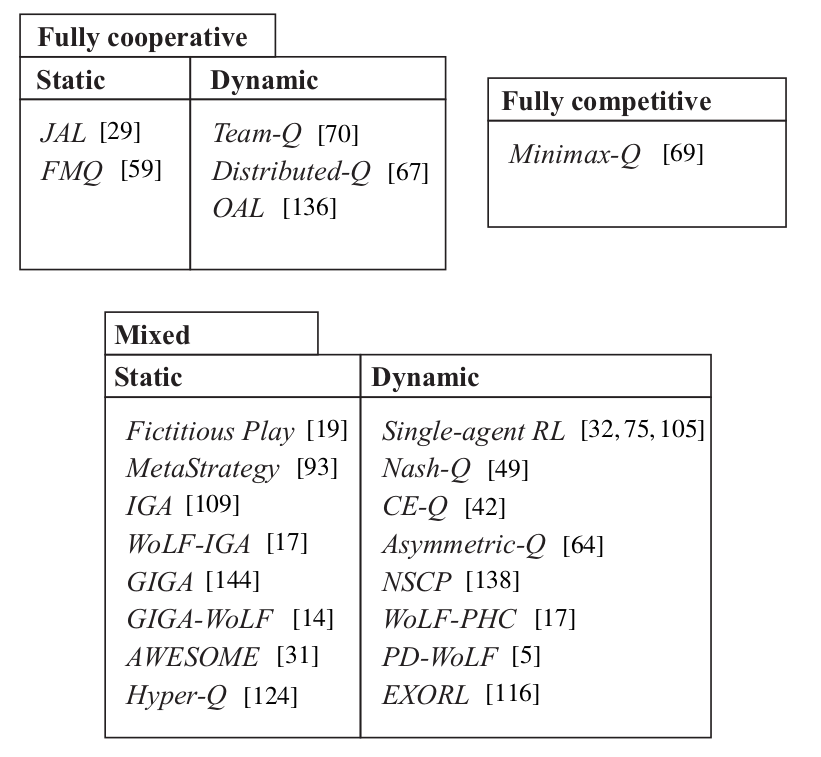
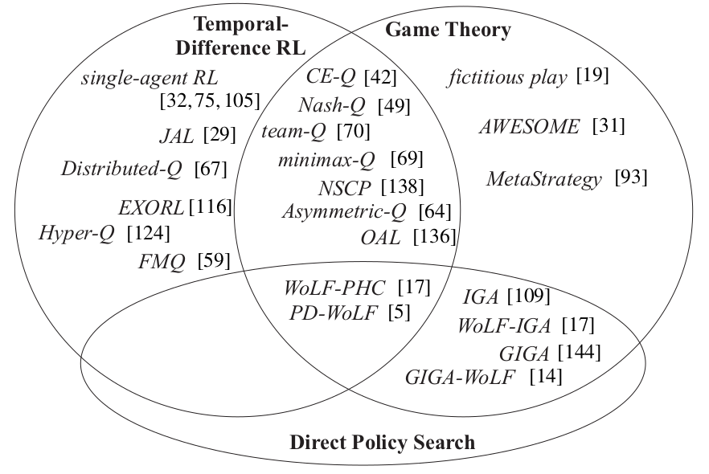
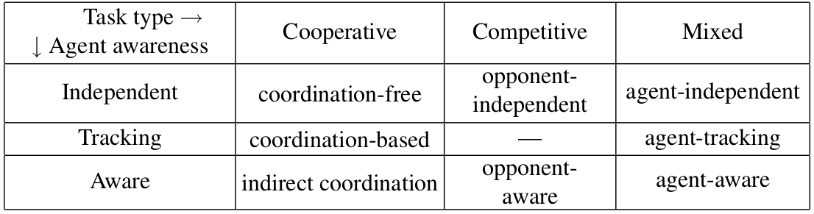

# Notes for MARL-Papers
## Overview2010
- 多智能体系统：
  - 算法分类：监督学习/非监督学习/强化学习
  - 任务类型：完全合作/完全竞争/混合
  - 学习目标类型：稳定性/适应性/混合
- 多智能体强化学习的优势与挑战：
  - 优点：
    - 共享经验：沟通、示教、模仿
    - 并行计算加速
    - 高扩展性：通过增加智能体数量来保证存活率，实现更快速的探索
  - 挑战：
    - 维数灾难
    - 确定学习目标：因多智能体之间的关联性导致很难设定一个很好的学习目标
    - 非平稳性：由于所有的智能体在系统中共同学习，每一个智能体都面临移动的学习目标问题：最优策略随着其他智能体策略的改变而改变。
    - 探索-实践的平衡会对在线学习系统产生明显的效率影响
    - 协作 考虑优化集体目标的前提下，优化自己的最大奖励
- 多智能体强化学习的目标：在完全合作的随机博弈中，共同的奖励可以联合最大化。在其他情况下,多智能体的奖励通常是不同而且相互关联的，不可能独立的被最优化。找到一个好的MARL学习目标通常是一件困难的事情。
  - 稳定性&适应性：两者的平衡
- 多智能体分类：
  - 任务类型分类：完全合作/完全竞争/混合（一些算法只针对非状态任务-static task（stateless））
  - 研究方向分类：博弈论、TD、策略搜索
  - 智能体感知方式（独立、跟随、感知（平衡））
- 多智能体的应用：仿真、分布式控制、多机器人、自动化交易、资源分配

- 多智能体强化学习的展望：
  - 扩展性依然是最重要的：高维度、连续动作
  - 离线MARL
  - ？一个切实可行的学习目标应该包括对瞬态性能界限
  - 环境的动态性（鲁棒控制可能可以试图解决该问题）、带噪声的